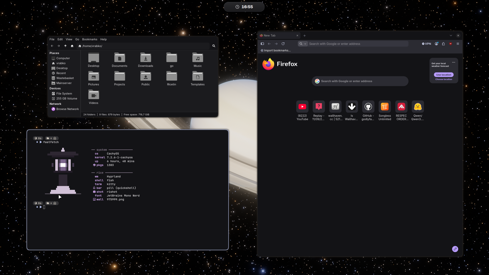
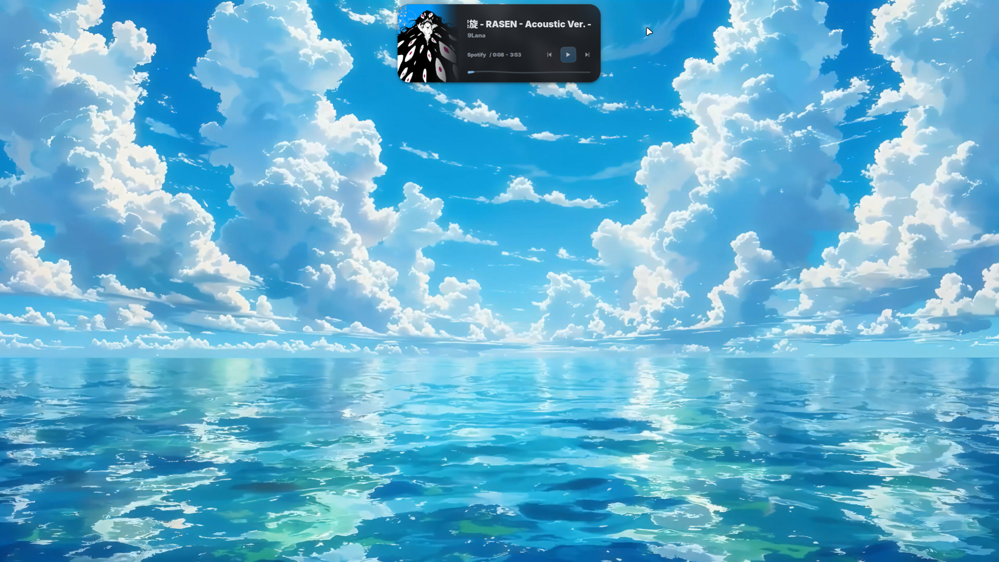

<div align="center">

# Sparrow Shell

**A complete, wallpaper-driven Hyprland rice for Arch Linux and CachyOS.**

[](https://hypr.land/)
[](https://quickshell.outfoxxed.me/)
[](https://github.com/Gakuseei/Ricelin)
[](https://cachyos.org/)
[](https://github.com/Retro-TV/sparrow-shell/actions)
[](LICENSE)

</div>



Sparrow Shell turns a minimal Arch-based install into a coordinated desktop:
Hyprland behavior, a morphing Quickshell pill, launcher and lock screen, dynamic
wallpaper colors, themed applications, terminal styling, screenshots, recording,
clipboard history, networking, media controls, and a safe update workflow.

The Quickshell foundation is based on [Ricelin](https://github.com/Gakuseei/Ricelin)
by Gakuseei. Sparrow Shell keeps that interaction model and substantially
customizes the palette system, app integration, Hyprland behavior, portability,
packaging, and update flow into a complete personal rice.

## What is included

| Layer | Sparrow Shell configuration |
| --- | --- |
| Window manager | Hyprland Lua config, workspaces, stash, rules, animations and keybinds |
| Desktop shell | Ricelin-based Quickshell pill, launcher, lock screen, OSDs and settings |
| Dynamic colors | Wallpaper analysis through Matugen with readable dark/light palettes |
| Themed apps | Firefox/Pywalfox, Vesktop, GTK/Thunar, Kitty, Ghostty and Fastfetch |
| Media | MPRIS controls, animated media pill, Spotify/Spicetify integration |
| Utilities | rishot, recorder, clipboard history, wallpaper picker and color picker |
| Maintenance | Backed-up installs, curated package sets and `sparrow-update` |



[Watch the 56-second desktop demo](docs/assets/demo.mp4)

## Install

> [!IMPORTANT]
> Sparrow Shell configures an existing Arch Linux or CachyOS installation. It
> does not partition disks, install a bootloader, GPU drivers, or a display
> manager. Read the dry run before applying it to an existing desktop.

From a terminal with network access and `sudo`:

```sh
sudo pacman -S --needed git
mkdir -p ~/.local/share
git clone https://github.com/Retro-TV/sparrow-shell.git ~/.local/share/sparrow-shell
cd ~/.local/share/sparrow-shell
./install.sh --dry-run --full
./install.sh --full
```

For a guided setup, run `./install.sh` without options. It presents a numbered
menu (or a `gum` menu when `gum` is already installed), pauses before Spotify
and Firefox integration steps, and offers a dry run before applying changes.

The installer backs up replaced files under
`~/.local/state/sparrow-shell-backups/`. The public monitor configuration uses
portable `preferred/auto` defaults; your real output names can be added after
the first boot.

Log out and select Hyprland from your display manager, or start it from a TTY:

```sh
Hyprland
```

See [Installation](docs/installation.md) for modes, prerequisites and the first
boot checklist.

## Installer modes

| Command | Effect |
| --- | --- |
| `./install.sh` | Dotfiles and Sparrow commands only |
| `./install.sh --packages` | Dotfiles plus the curated desktop core |
| `./install.sh --apps` | Configure already-installed themed apps |
| `./install.sh --full` | Core packages, themed apps and integrations |
| `./install.sh --wallpaper FILE` | Apply a wallpaper and regenerate colors |
| `./install.sh --system-keymap` | Opt in to the maintainer's Slovenian keymap |
| `./install.sh --dry-run ...` | Print every planned operation without changing anything |
| `./install.sh` | Guided interactive installer |

The full machine snapshot remains in `packages/pacman-explicit.txt` for
reference. It is deliberately **not** installed on other machines; the curated
`core.txt` and `apps.txt` manifests are used instead.

## Daily use

```sh
sparrow-shell status
sparrow-shell restart pill
sparrow-shell log pill
sparrow-update --dry-run
sparrow-update
```

`sparrow-update` only accepts the official repository remote, refuses a dirty
checkout, pulls with fast-forward only, reapplies the rice, and never commits or
pushes. A full system upgrade is intentionally opt-in with
`sparrow-update --upgrade-system`.

The maintainer-only publisher remains a separate local command named
`rice-update`. Its source and GitHub credentials are not distributed here.

## Documentation

- [Installation and first boot](docs/installation.md)
- [Dynamic theming](docs/theming.md)
- [Architecture and update model](docs/architecture.md)
- [Keybindings](docs/keybindings.md)
- [Troubleshooting](docs/troubleshooting.md)
- [Captured system inventory](docs/inventory.md)
- [Manual integration steps](docs/manual-steps.md)
- [Third-party credits](THIRD_PARTY.md)

## Scope and privacy

The repository contains configuration—not account state. It excludes browser
profiles, cookies, tokens, Discord/Spotify sessions, SSH keys, wallpaper
collections, screenshots from daily use, caches, and GitHub credentials.
Hardware-specific RGB support is included as an optional example and is not
enabled automatically.

## Credits

Sparrow Shell uses modified Quickshell and Hyprland components from
[Gakuseei/Ricelin](https://github.com/Gakuseei/Ricelin), licensed under MIT.
[rishot](https://github.com/Gakuseei/rishot) is also authored by Gakuseei and is
installed from its own repository. Full notices are in [THIRD_PARTY.md](THIRD_PARTY.md).

## License

MIT. See [LICENSE](LICENSE). Third-party components retain their own notices.
