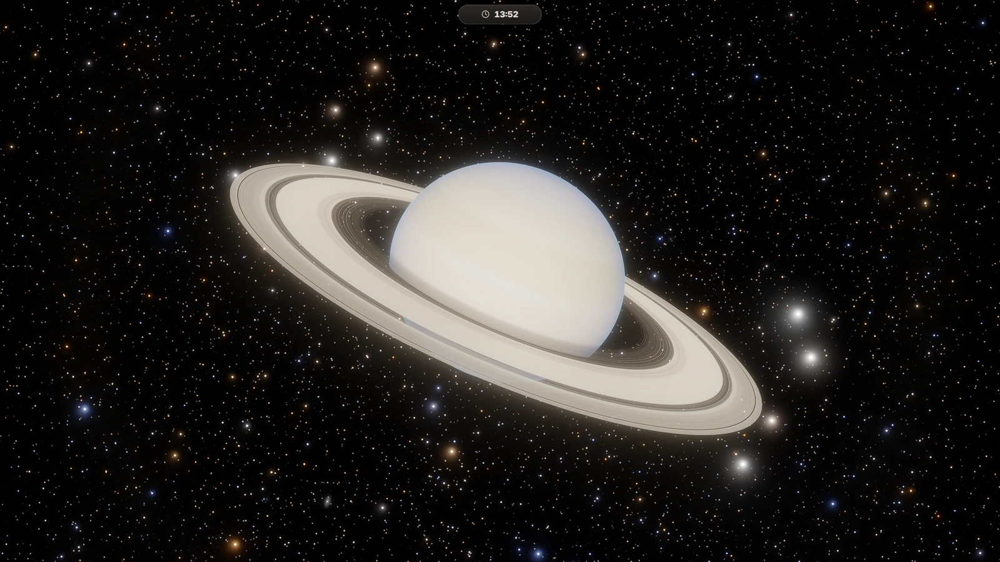
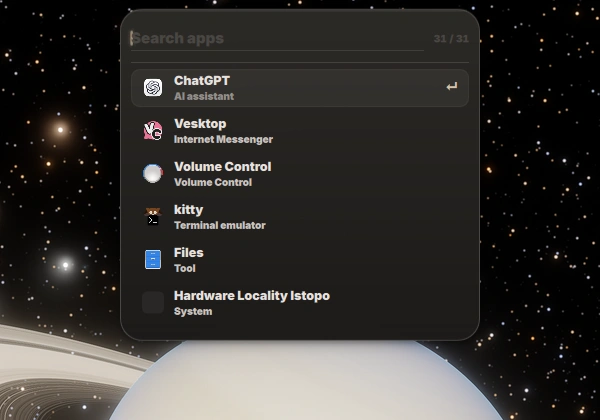
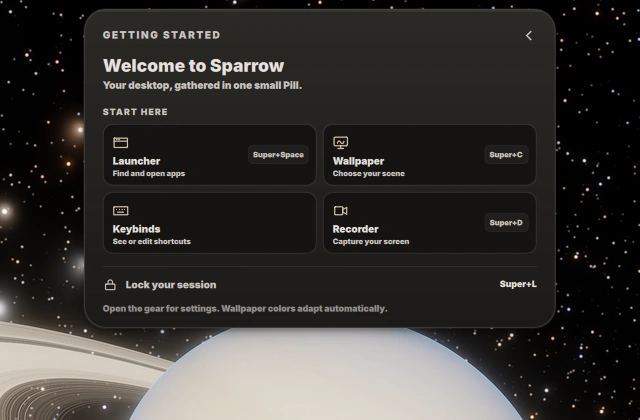
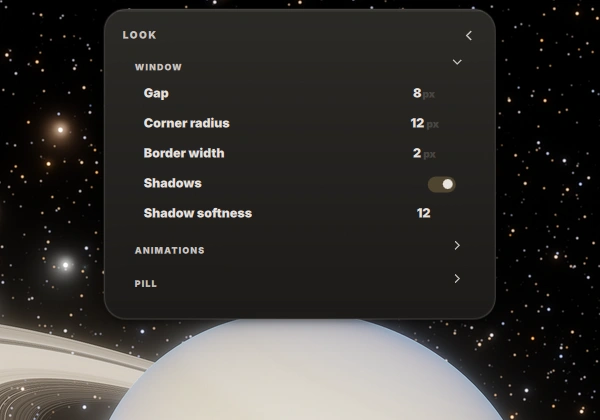
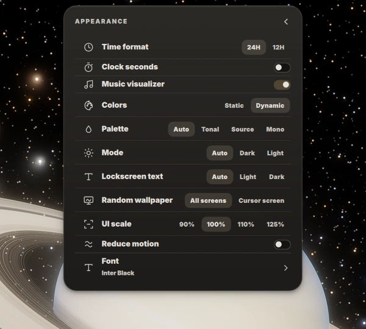
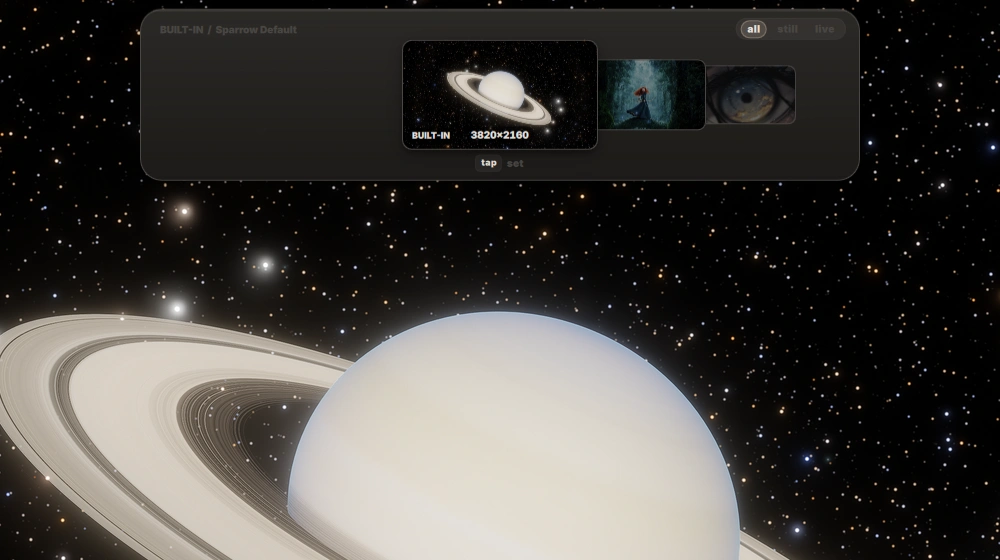

<div align="center">

# Sparrow Shell

**A small Quickshell interface and Niri-centered desktop rice, gathered into one morphing pill.**

<a href="https://github.com/Retro-TV/sparrow-shell/blob/main/LICENSE"></a>


<br><br>



</div>

## Install

Tested on a **fresh CachyOS installation**. Sparrow is intended for Arch-based
systems, but other distributions and package combinations have not had the same
bare-metal test. The installer uses pacman and does not install an AUR helper;
on systems where `mpvpaper` is not available from configured pacman
repositories, install it through your reviewed package workflow before running
Sparrow.

If Git is not already installed:

```sh
sudo pacman -S --needed git
```

Then clone and run the installer as your normal user:

```sh
git clone https://github.com/Retro-TV/sparrow-shell.git
cd sparrow-shell
./install.sh
```

The installer sets up the complete default Sparrow desktop, including its
packages, Niri integration, Quickshell runtime, theme generation, screenshot
tool, and tested greetd/tuigreet login on a compatible clean system. It may
request `sudo` authorization for packages and system login integration. It
keeps backups and asks before replacing a conflicting display manager or
meaningful existing configuration; it does not start greetd under your current
session.

On a clean compatible install, reboot after installation to enter the new
tuigreet login on tty1. Sign in and Sparrow starts with Niri. Existing display
manager setups are preserved unless you explicitly choose Sparrow's login
integration. The installer prepares tty2 as a recovery console before changing
login-manager ownership.

## What is Sparrow?

Sparrow is a Quickshell shell/interface designed around the Niri Wayland
compositor, with a coordinated desktop configuration and installer. Niri owns
window management, workspaces, outputs, and input; Sparrow provides the
surfaces and controls around that session. It is a rice, not a full desktop
environment.

The permanent interface stays intentionally small: wallpaper, applications,
and one pill. Open a feature when you need it; the pill morphs into that
surface instead of keeping a collection of panels and widgets on screen. The
rule is simple: if the maintainer does not actually use something, it should
not be there.

## What it includes

- **One morphing pill:** app launcher, dynamic Niri workspaces, wallpaper
  picker, calendar, media, notifications, tray, and power/session controls.
- **Desktop controls:** Niri Look, Display, Input, and Keybind settings, plus
  audio Mixer, device-aware brightness, Wi-Fi, Bluetooth, battery/peripherals,
  and idle/lock controls.
- **Capture:** screen recording through GPU Screen Recorder and screenshots
  through Rishot, both integrated with Sparrow's shortcuts and surfaces.
- **Wallpaper-led appearance:** still and animated wallpapers, with a generated
  palette shared by Sparrow, Niri, Kitty, and Sparrow-integrated GTK apps.
- **A ready-to-use desktop:** Kitty, Fish, Starship, Thunar, scoped GTK
  integration, cursor/fonts, portals, and a greetd/tuigreet login option.

Hardware-dependent controls appear when the required device or backend is
available. Sparrow's primary session lock is its Quickshell/PAM lockscreen;
Hyprlock is only an optional fallback.

## In the pill

<table>
  <tr>
    <td width="50%"><br><sub>Launcher</sub></td>
    <td width="50%"><br><sub>Getting Started</sub></td>
  </tr>
  <tr>
    <td width="50%"><br><sub>Look</sub></td>
    <td width="50%"><br><sub>Appearance</sub></td>
  </tr>
</table>

<p align="center">
  <br>
  <sub>Choose a still or animated wallpaper; the selected scene feeds Sparrow's palette.</sub>
</p>

## Wallpaper and theming

Sparrow's wallpaper flow feeds the palette used across the shell and desktop:

**Wallpaper → Matugen palette → Sparrow · Niri · Kitty · selected GTK apps**

Changing wallpaper can update the palette as well. GTK theming is deliberately
scoped to Sparrow-integrated applications such as Thunar, the GTK file chooser,
and pavucontrol; Sparrow does not globally force its GTK theme onto unrelated
apps or browsers.

Use Sparrow's Appearance and Look surfaces for the controls they expose. Niri
user overrides and personal state are kept separate from portable defaults;
generated palette/theme files are regenerated from their inputs. Avoid editing
generated output by hand.

## Login and shortcuts

On a clean compatible installation, greetd with the stock-looking tuigreet
starts Niri after authentication and remembers the username/session. F3 keeps
session selection available and F12 opens power controls. Sparrow's own
Quickshell lock is used inside the session.

Common defaults:

| Shortcut | Action |
| --- | --- |
| `Super+Space` | Launcher |
| `Super+C` / `Super+B` | Wallpaper picker / next wallpaper |
| `Super+T` / `Super+E` / `Super+F` | Kitty / Thunar / Firefox |
| `Super+O` | Niri Overview |
| `Super+L` | Lock session |
| `Super+Shift+S` | Screenshot with Rishot |

The Keybinds surface shows the current bindings and supports the key changes
Sparrow exposes.

## Update and restore

To update a clone and reapply managed files safely:

```sh
git pull --ff-only
./install.sh
```

To restore Sparrow-managed files and system integration:

```sh
./uninstall.sh
```

Uninstall preserves packages, personal state, generated caches, wallpapers,
recordings, and user-edited files. If Sparrow is active, it normally leaves
running processes until the session ends; `./uninstall.sh --stop-now` asks
before stopping them immediately. Backups and detailed recovery behavior are
documented in the installer inventory.

## Project status

The complete default install has passed a fresh bare-metal CachyOS test.
Sparrow is still a young personal project and may evolve; compatibility beyond
the tested CachyOS setup should be treated as unverified.

## Documentation and credits

- [Dependencies and package notes](docs/DEPENDENCIES.md)
- [What the installer deploys](docs/INSTALL-INVENTORY.md)
- [Runtime paths and configuration ownership](docs/PORTABILITY-ARCHITECTURE.md)
- [Wallpaper and palette behavior](quickshell/sparrow/WALLPAPER-PALETTE.md)
- [Third-party licenses and attribution](THIRD_PARTY.md)

Sparrow incorporates and adapts work from Ricelin and Qylock, includes a
Papirus-derived icon subset and the Outfit font, and installs Rishot from its
pinned upstream source. Their respective notices and licenses are retained in
the repository. Sparrow is licensed GPL-3.0-only except where
[third-party notices](THIRD_PARTY.md) identify separately licensed material.
